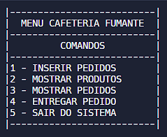
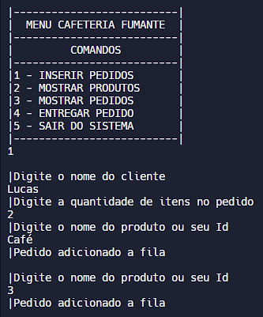
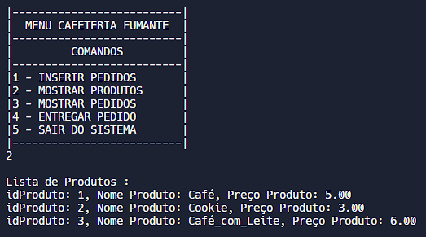
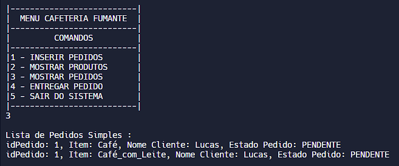
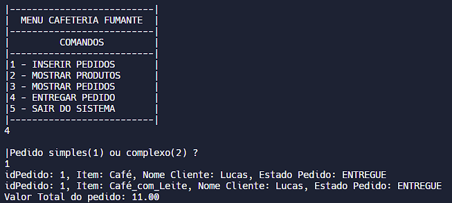
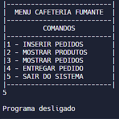

#  Café fumante
Criado para simular um Menu de uma cafeteria em C, contendo uma lista de produtos, duas filas e listas de pedidos. Possuindo as funções de receber, armazenar e listar pedidos e produtos, todas com validações de valores.
Partes do Projeto:
* [Menu](#menu)
    *[Inserir Pedidos](#inserir-pedidos)
    *[Mostrar Produtos](#mostrar-produtos)
    *[Mostrar Pedidos](#mostrar-pedidos)
    *[Entregar Pedido](#entregar-pedido)
    *[Sair do Sistema](#sair-do-sistema)
* [Cardápio](#cardápio)
## Menu
# 
Menu simples, criado para solucionar as principais necessidades do estabelecimento, para selecionar a função deseja basta digitar o número.
### Inserir Pedidos

O sistema pede o nome do cliente, a quantidade de itens e o nome do Produto ou seu id.

### Mostrar Produtos

O sistema exibe a lista de produtos da loja, contendo seu id, nome e preço.

### Mostrar Pedidos

O sistema exibe a lista de pedidos simples e complexos, cada pedido contém seu id, nome do produto, nome do cliente e estado(pendente ou entregue).

### Entregar Pedido

O sistema confere na fila de pedidos qual foi o primeiro a ser registrado, a partir disso ele modifica o estado do pedido para entregue e calcula seu preço total.

### Sair do Sistema

O sistema encerra suas operações.

## Cardápio
O cardápio contém:
* Café
* Cookie
* Café com leite