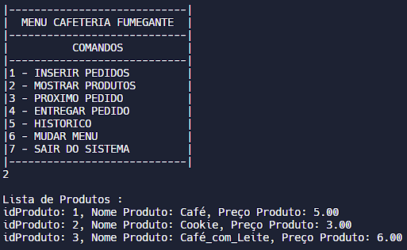
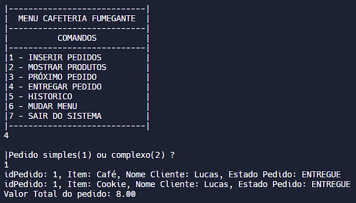

# Café fumegante
Criado para simular um Menu de uma cafeteria em C, contendo uma lista de produtos, duas filas e listas de pedidos. Possuindo as funções de receber, armazenar e listar pedidos e produtos, todas com validações de valores.
Partes do Projeto:
* [Menu Principal](#menu-principal)
* [Menu de Pedidos](#menu-pedidos)
    * [Inserir Pedidos](#inserir-pedidos)
    * [Mostrar Produtos](#mostrar-produtos)
    * [Próximo Pedido](#próximo-pedido)
    * [Entregar Pedido](#entregar-pedido)
    * [Histórico de Pedidos](#histórico-de-pedidos)
    * [Mudar Menu](#mudar-menu)
    * [Sair do Sistema](#sair-do-sistema)
* [Menu de Funcionários](#menu-de-funcionários)
    * [Exibir Funcionários](#exibir-funcionários)
    * [Inserir Funcionário](#inserir-funcionário)
    * [Remover Funcionários](#remover-funcionário)
    * [Funcionários por Turno](#funcionários-por-turno)
    * [Mudar Menu](#mudar-menu-1)
    * [Sair do Sistema](#sair-do-sistema-1)
* [Cardápio](#cardápio)

## Menu Principal

O sistema inicia pedindo a senha e oferencendo a opção de dois Menus.

## Menu de Pedidos

Menu simples, criado para solucionar as principais necessidades do estabelecimento, para selecionar a função deseja basta digitar o número.

### Inserir Pedidos

O sistema pede o nome do cliente, a quantidade de itens e o nome do Produto ou seu id.

### Mostrar Produtos

O sistema exibe a lista de produtos da loja, contendo seu id, nome e preço.

### Próximo Pedido

O sistema mostra o próximo pedido a ser entregue na fila simples e complexa.

### Entregar Pedido

O sistema confere na fila de pedidos qual foi o primeiro a ser registrado, a partir disso ele modifica o estado do pedido para entregue e calcula seu preço total.

### Histórico de Pedidos

O sistema mostra o histórico de pedidos simples e complexos.

### Mudar Menu

O sistema volta ao menu anterior.

### Sair do Sistema

O sistema encerra suas operações.

## Menu de Funcionários

Menu simples, criado para gerenciar os funcionários de uma cafeteria.

### Exibir Funcionários

O sistema exibe todos os funcionários.

### Inserir Funcionário

O sistema pede o nome do funcionário, cargo, turno e salário.

### Remover Funcionário

O sistema pede o id do funcionário e o remove da lista, caso o funcionário com o id selecionado não exista ele retorna uma mensagem de "Funcionário com id não identificado".

### Funcionários por Turno

O sistema exibe a lista de funcionários do turno Matutino e Noturno.

### Mudar Menu

O sistema volta ao menu anterior.

### Sair do Sistema

O sistema encerra suas operações.

## Cardápio
O cardápio contém:
* Café
* Cookie
* Café com leite
